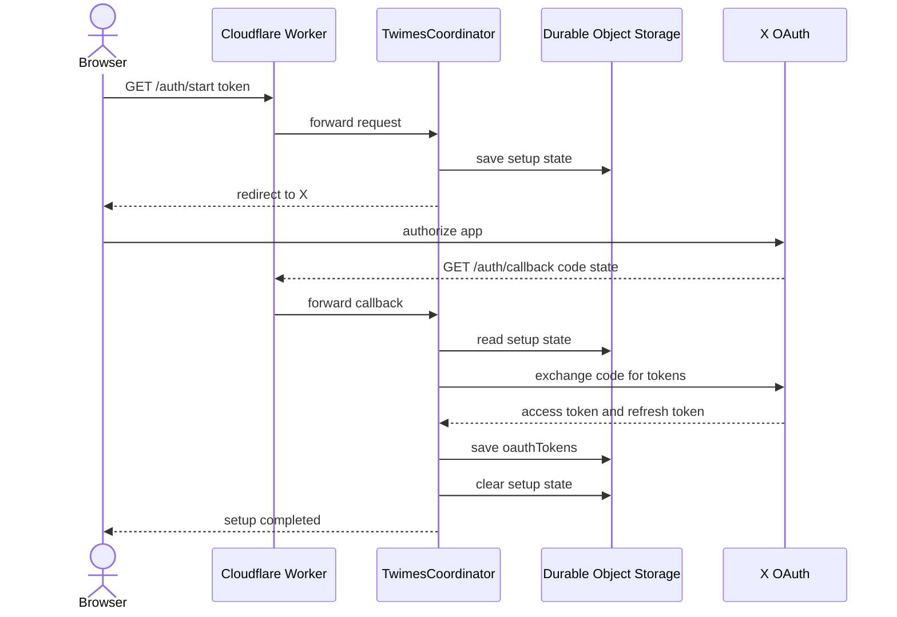
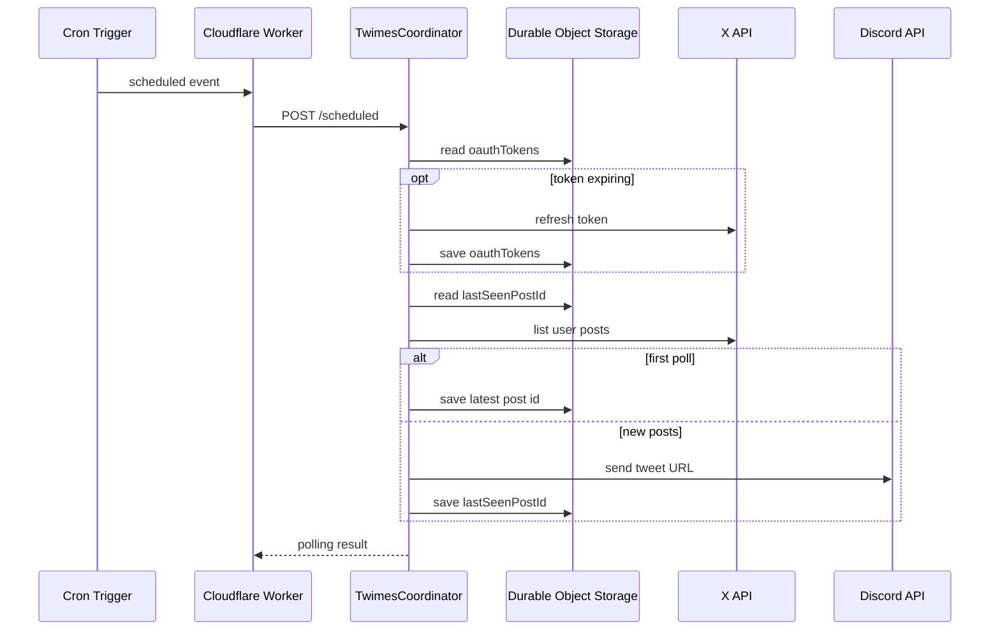

# twimes

## Overview

`twimes` は、X の指定ユーザーの投稿を 1 分ごとに取得し、Discord チャンネルへ転送する **Cloudflare Workers** アプリです。

X API から `/2/users/:id/tweets` を読み、Discord には `fixupx.com` の投稿 URL を送ります。

初回の polling では過去投稿を送らず、最新投稿 ID だけを保存します。
2 回目以降の polling では、その ID より新しい投稿だけを古い順に送ります。

## Setup

### Configuration

`wrangler.jsonc` の `vars` には、公開してよい設定値を置きます。

- `DISCORD_CHANNEL_ID`
- `TWITTER_USER_ID`
- `TWITTER_USERNAME`

secret には、公開できない値を置きます。

```bash
pnpm wrangler secret put DISCORD_BOT_TOKEN
pnpm wrangler secret put TWITTER_CLIENT_ID
pnpm wrangler secret put TWITTER_CLIENT_SECRET
pnpm wrangler secret put SETUP_TOKEN
```

Discord Bot には、対象チャンネルで `Send Messages` と `Embed Links` 権限が必要です。

### OAuth setup

**OAuth setup** は、X API を読むための token を Durable Object storage に保存する手順です。
polling とは別の手動手順です。

`/auth/start` は `SETUP_TOKEN` を検証します。
`/auth/callback` で照合に成功すると、`oauthTokens` を保存し、`oauthSetupState` を削除します。



X OAuth scope は次の値です。

```text
tweet.read users.read offline.access
```

ローカルでは Worker を起動してから `/auth/start` を開きます。

```bash
pnpm dev
open "http://localhost:8787/auth/start?token=<SETUP_TOKEN>"
```

本番では、deploy 後の Worker URL で同じ endpoint を開きます。

OAuth token が未設定の場合、scheduled event は `Twitter OAuth tokens are not configured. Open /auth/start first.` で失敗します。

## Operations

### Checks

静的検証とテスト：

```bash
pnpm test
pnpm typecheck
pnpm lint
pnpm format:check
```

### Manual polling

ローカルで scheduled event を手動実行：

```bash
pnpm dev
curl "http://localhost:8787/cdn-cgi/handler/scheduled?format=json"
```

### Logs

**X API call log** は、Workers Logs の Query Builder で `event = "x_api_call"` を検索すると確認できます。

主な絞り込み条件は次のとおりです。

- `operation = "list_user_posts"`：投稿取得。
- `operation = "refresh_tokens"`：OAuth token refresh。
- `operation = "exchange_authorization_code"`：初回 OAuth callback の token exchange。
- `ok = false`：失敗した X API 呼び出し。

ログには `status`、`durationMs`、`endpoint` を出します。
`accessToken`、`refreshToken`、`clientSecret`、OAuth `code` は出しません。

## Design

### Architecture

- **Coordinator**：`idFromName("default")` で取得した `TwimesCoordinator` に、OAuth endpoint と scheduled event を転送します。
- **Storage**：OAuth token、OAuth setup state、最後に処理した投稿 ID は、同じ Durable Object storage に保存します。
- **Trigger**：起動契機は Workers Cron Trigger で、Durable Object alarm は使っていません。
- **Scope**：単一の X アカウントを単一の Discord チャンネルへ転送する構成で、shard 構成ではありません。

`wrangler.jsonc` の cron は `* * * * *` です。

### Polling flow

scheduled event は Worker の `scheduled` handler で受け取り、内部リクエストとして `POST /scheduled` を `TwimesCoordinator` へ送ります。



Coordinator は `runningPoll` に実行中の Promise を保持します。
同じ instance 内で polling が重なった場合は、新しい polling を始めず、実行中の結果へ合流します。

access token は、期限まで 60 秒以内なら refresh token で更新します。

Discord へ送る本文は投稿 URL だけです。
mention は無効化し、通知抑制フラグを付けます。

### State

Durable Object storage には、実行状態として次の値を保存します。

- **oauthTokens**：X API の `accessToken`、`refreshToken`、`expiresAt`、`tokenType`、`scope` を保持します。
- **oauthSetupState**：OAuth callback まで使う `state`、`codeVerifier`、`createdAt` を保持します。
- **lastSeenPostId**：最後に処理した投稿 ID を保持します。

`oauthSetupState` は OAuth setup の途中だけ使います。
作成から 10 分を過ぎた callback は失敗し、setup state は破棄されます。
